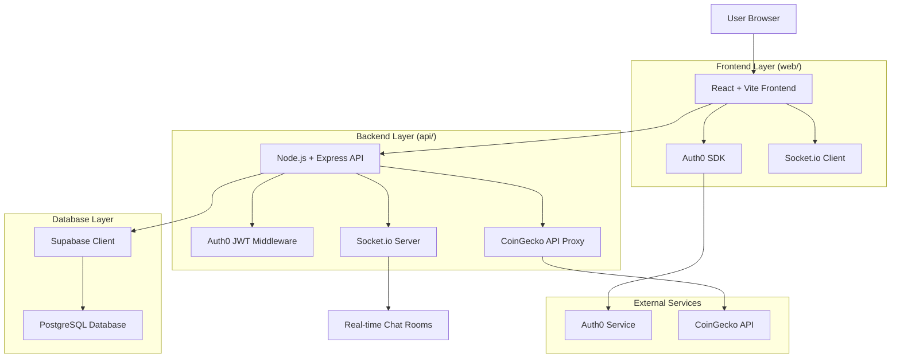
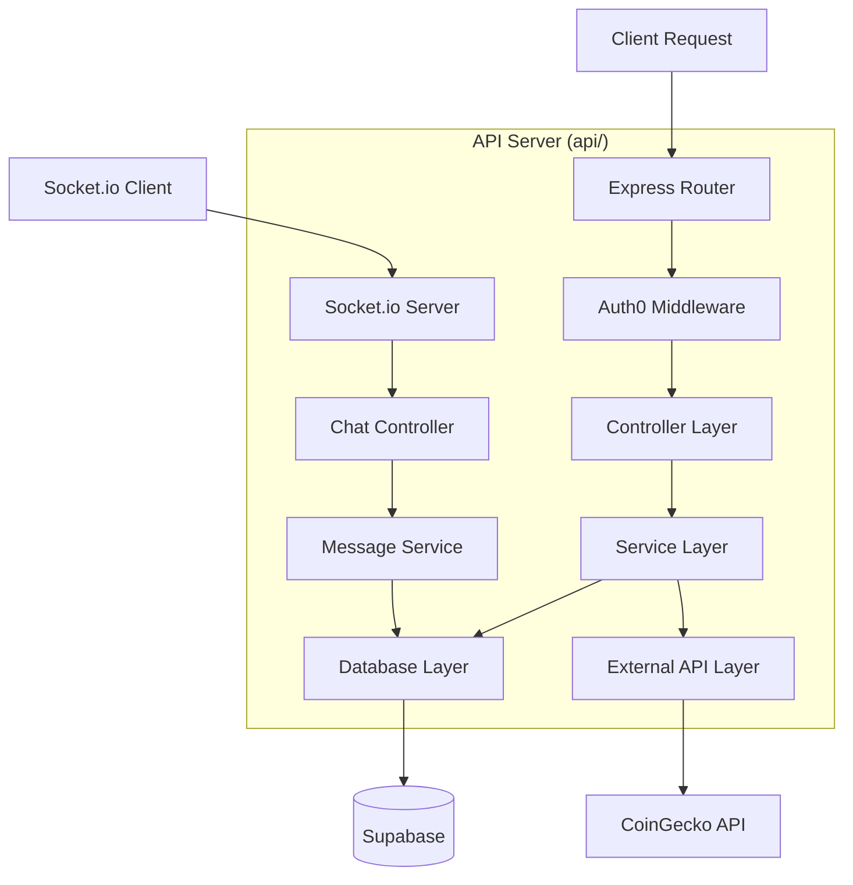
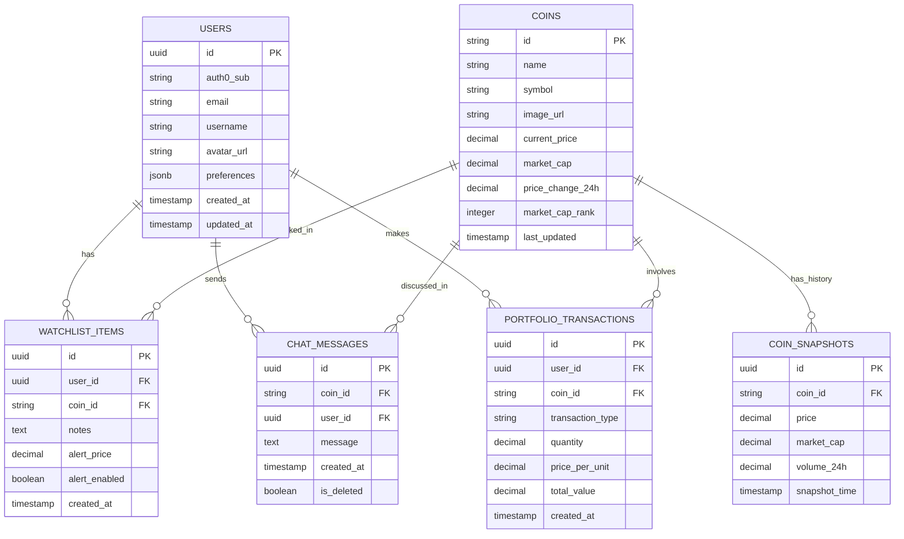

# Crypto Onboarding App - Technical Architecture Document

## 1. Architecture Design



## 2. Technology Description

* **Frontend**: React\@18 + Vite + TypeScript + Tailwind CSS + Auth0 React SDK + Socket.io Client + Chart.js/TradingView

* **Backend**: Node.js + Express\@4 + Socket.io + Auth0 JWT verification + Helmet + CORS + Rate limiting

* **Database**: Supabase (PostgreSQL) with Row Level Security

* **Authentication**: Auth0 (SPA + API configuration)

* **Development**: Docker Compose for local environment

* **Deployment**: Vercel (frontend) + Render (backend)

* **Quality Tools**: ESLint + Prettier + Husky + lint-staged + Jest

## 3. Route Definitions

| Route         | Purpose                                           |
| ------------- | ------------------------------------------------- |
| /             | Dashboard with trending coins and market overview |
| /coin/:id     | Coin detail page with charts and real-time chat   |
| /watchlist    | User's personal coin watchlist management         |
| /portfolio    | Portfolio simulation and ROI calculator           |
| /login        | Auth0 login page                                  |
| /profile      | User profile and preferences management           |
| /chat/:coinId | Dedicated chat room for specific cryptocurrency   |

## 4. API Definitions

### 4.1 Core API

**Trending Coins**

```
GET /api/coins/trending
```

Response:

| Param Name  | Param Type | Description                              |
| ----------- | ---------- | ---------------------------------------- |
| coins       | Coin\[]    | Array of trending cryptocurrency objects |
| lastUpdated | string     | ISO timestamp of last data update        |
| cacheExpiry | number     | Cache expiration time in seconds         |

**Coin Market Data**

```
GET /api/coins/:id/market
```

Request:

| Param Name   | Param Type | isRequired | Description                     |
| ------------ | ---------- | ---------- | ------------------------------- |
| id           | string     | true       | CoinGecko coin identifier       |
| vs\_currency | string     | false      | Target currency (default: usd)  |
| days         | string     | false      | Price history days (default: 7) |

Response:

| Param Name         | Param Type   | Description                      |
| ------------------ | ------------ | -------------------------------- |
| id                 | string       | Coin identifier                  |
| name               | string       | Coin name                        |
| symbol             | string       | Coin symbol                      |
| current\_price     | number       | Current price in target currency |
| market\_cap        | number       | Total market capitalization      |
| price\_change\_24h | number       | 24-hour price change             |
| price\_history     | number\[]\[] | Historical price data points     |

**User Watchlist**

```
GET /api/user/watchlist
POST /api/user/watchlist
DELETE /api/user/watchlist/:coinId
```

POST Request:

| Param Name | Param Type | isRequired | Description               |
| ---------- | ---------- | ---------- | ------------------------- |
| coinId     | string     | true       | CoinGecko coin identifier |
| notes      | string     | false      | User notes for the coin   |
| alertPrice | number     | false      | Price alert threshold     |

Response:

| Param Name | Param Type       | Description                   |
| ---------- | ---------------- | ----------------------------- |
| watchlist  | WatchlistItem\[] | Array of user's watched coins |
| totalCount | number           | Total number of watched coins |

### 4.2 Socket.io Events

**Chat Namespace: /chat**

**Join Room**

```
Event: join_room
Payload: { coinId: string, userId: string }
```

**Send Message**

```
Event: send_message
Payload: { coinId: string, message: string, userId: string }
```

**Receive Message**

```
Event: new_message
Payload: { id: string, coinId: string, message: string, userId: string, username: string, timestamp: string }
```

**Leave Room**

```
Event: leave_room
Payload: { coinId: string, userId: string }
```

## 5. Server Architecture Diagram



## 6. Data Model

### 6.1 Data Model Definition



### 6.2 Data Definition Language

**Users Table**

```sql
CREATE TABLE users (
    id UUID PRIMARY KEY DEFAULT gen_random_uuid(),
    auth0_sub VARCHAR(255) UNIQUE NOT NULL,
    email VARCHAR(255) NOT NULL,
    username VARCHAR(100) NOT NULL,
    avatar_url TEXT,
    preferences JSONB DEFAULT '{}',
    created_at TIMESTAMP WITH TIME ZONE DEFAULT NOW(),
    updated_at TIMESTAMP WITH TIME ZONE DEFAULT NOW()
);

-- Enable RLS
ALTER TABLE users ENABLE ROW LEVEL SECURITY;

-- Policies
CREATE POLICY "Users can view own profile" ON users
    FOR SELECT USING (auth.jwt() ->> 'sub' = auth0_sub);

CREATE POLICY "Users can update own profile" ON users
    FOR UPDATE USING (auth.jwt() ->> 'sub' = auth0_sub);

-- Indexes
CREATE INDEX idx_users_auth0_sub ON users(auth0_sub);
CREATE INDEX idx_users_email ON users(email);

-- Grants
GRANT SELECT ON users TO authenticated;
GRANT UPDATE ON users TO authenticated;
```

**Coins Table**

```sql
CREATE TABLE coins (
    id VARCHAR(100) PRIMARY KEY,
    name VARCHAR(255) NOT NULL,
    symbol VARCHAR(20) NOT NULL,
    image_url TEXT,
    current_price DECIMAL(20,8),
    market_cap BIGINT,
    price_change_24h DECIMAL(10,4),
    market_cap_rank INTEGER,
    last_updated TIMESTAMP WITH TIME ZONE DEFAULT NOW()
);

-- Indexes
CREATE INDEX idx_coins_symbol ON coins(symbol);
CREATE INDEX idx_coins_market_cap_rank ON coins(market_cap_rank);
CREATE INDEX idx_coins_last_updated ON coins(last_updated DESC);

-- Enable RLS
ALTER TABLE coins ENABLE ROW LEVEL SECURITY;

-- Policies
CREATE POLICY "Coins are viewable by everyone" ON coins
    FOR SELECT USING (true);

-- Grants
GRANT SELECT ON coins TO anon;
GRANT ALL PRIVILEGES ON coins TO authenticated;
```

**Watchlist Items Table**

```sql
CREATE TABLE watchlist_items (
    id UUID PRIMARY KEY DEFAULT gen_random_uuid(),
    user_id UUID REFERENCES users(id) ON DELETE CASCADE,
    coin_id VARCHAR(100) REFERENCES coins(id) ON DELETE CASCADE,
    notes TEXT,
    alert_price DECIMAL(20,8),
    alert_enabled BOOLEAN DEFAULT false,
    created_at TIMESTAMP WITH TIME ZONE DEFAULT NOW(),
    UNIQUE(user_id, coin_id)
);

-- Indexes
CREATE INDEX idx_watchlist_user_id ON watchlist_items(user_id);
CREATE INDEX idx_watchlist_coin_id ON watchlist_items(coin_id);

-- Enable RLS
ALTER TABLE watchlist_items ENABLE ROW LEVEL SECURITY;

-- Policies
CREATE POLICY "Users can manage own watchlist" ON watchlist_items
    FOR ALL USING (
        user_id IN (
            SELECT id FROM users WHERE auth0_sub = auth.jwt() ->> 'sub'
        )
    );

-- Grants
GRANT ALL PRIVILEGES ON watchlist_items TO authenticated;
```

**Chat Messages Table**

```sql
CREATE TABLE chat_messages (
    id UUID PRIMARY KEY DEFAULT gen_random_uuid(),
    coin_id VARCHAR(100) REFERENCES coins(id) ON DELETE CASCADE,
    user_id UUID REFERENCES users(id) ON DELETE CASCADE,
    message TEXT NOT NULL,
    created_at TIMESTAMP WITH TIME ZONE DEFAULT NOW(),
    is_deleted BOOLEAN DEFAULT false
);

-- Indexes
CREATE INDEX idx_chat_messages_coin_id ON chat_messages(coin_id);
CREATE INDEX idx_chat_messages_created_at ON chat_messages(created_at DESC);
CREATE INDEX idx_chat_messages_user_id ON chat_messages(user_id);

-- Enable RLS
ALTER TABLE chat_messages ENABLE ROW LEVEL SECURITY;

-- Policies
CREATE POLICY "Chat messages are viewable by authenticated users" ON chat_messages
    FOR SELECT USING (auth.role() = 'authenticated' AND is_deleted = false);

CREATE POLICY "Users can insert own messages" ON chat_messages
    FOR INSERT WITH CHECK (
        user_id IN (
            SELECT id FROM users WHERE auth0_sub = auth.jwt() ->> 'sub'
        )
    );

-- Grants
GRANT SELECT, INSERT ON chat_messages TO authenticated;
```

**Initial Data**

```sql
-- Sample coins data
INSERT INTO coins (id, name, symbol, current_price, market_cap_rank) VALUES
('bitcoin', 'Bitcoin', 'BTC', 45000.00, 1),
('ethereum', 'Ethereum', 'ETH', 3000.00, 2),
('cardano', 'Cardano', 'ADA', 1.20, 3),
('polkadot', 'Polkadot', 'DOT', 25.00, 4),
('chainlink', 'Chainlink', 'LINK', 28.00, 5);

-- Function to clean old chat messages (keep last 50 per coin)
CREATE OR REPLACE FUNCTION cleanup_old_messages()
RETURNS void AS $$
BEGIN
    DELETE FROM chat_messages 
    WHERE id NOT IN (
        SELECT id FROM (
            SELECT id, ROW_NUMBER() OVER (
                PARTITION BY coin_id 
                ORDER BY created_at DESC
            ) as rn
            FROM chat_messages 
            WHERE is_deleted = false
        ) ranked 
        WHERE rn <= 50
    );
END;
$$ LANGUAGE plpgsql;
```

## 7. Security Implementation

### 7.1 Authentication & Authorization

* Auth0 JWT tokens for API authentication

* Row Level Security (RLS) policies in Supabase

* Protected Socket.io events requiring valid JWT

* User session management with token refresh

### 7.2 API Security

* Helmet.js for security headers

* CORS allowlist for trusted origins

* Rate limiting per IP and user

* Input validation with Joi schemas

* SQL injection prevention via parameterized queries

### 7.3 Environment Variables

```env
# Auth0 Configuration
AUTH0_DOMAIN=your-domain.auth0.com
AUTH0_CLIENT_ID=your-client-id
AUTH0_CLIENT_SECRET=your-client-secret
AUTH0_AUDIENCE=your-api-audience

# Supabase Configuration
SUPABASE_URL=https://your-project.supabase.co
SUPABASE_ANON_KEY=your-anon-key
SUPABASE_SERVICE_KEY=your-service-key

# API Configuration
COINGECKO_API_KEY=your-coingecko-api-key
PORT=3001
NODE_ENV=development

# Frontend Configuration
VITE_AUTH0_DOMAIN=your-domain.auth0.com
VITE_AUTH0_CLIENT_ID=your-client-id
VITE_AUTH0_AUDIENCE=your-api-audience
VITE_API_BASE_URL=http://localhost:3001
```

## 8. Deployment Configuration

### 8.1 Docker Compose (Local Development)

```yaml
version: '3.8'
services:
  web:
    build: ./web
    ports:
      - "3000:3000"
    environment:
      - VITE_API_BASE_URL=http://localhost:3001
    volumes:
      - ./web:/app
      - /app/node_modules
    
  api:
    build: ./api
    ports:
      - "3001:3001"
    environment:
      - NODE_ENV=development
      - PORT=3001
    volumes:
      - ./api:/app
      - /app/node_modules
    depends_on:
      - redis
      
  redis:
    image: redis:alpine
    ports:
      - "6379:6379"
```

### 8.2 Production Deployment

* **Frontend**: Deploy to Vercel with environment variables

* **Backend**: Deploy to Render with auto-scaling

* **Database**: Supabase managed PostgreSQL

* **Caching**: Redis for API response caching

* **Monitoring**: Error tracking with Sentry

* **CI/CD**: GitHub Actions for automated testing and deployment

