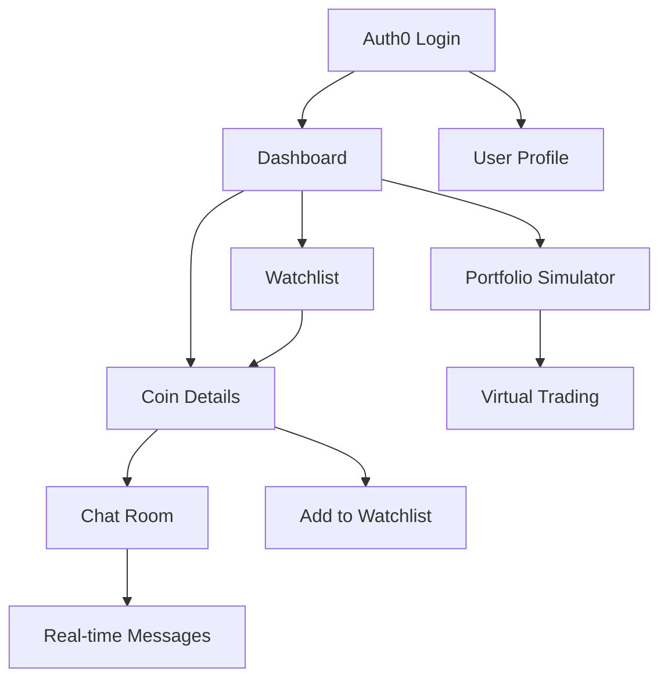

# Crypto Onboarding App - Product Requirements Document

## 1. Product Overview
A beginner-friendly cryptocurrency exploration platform that enables users to discover trending coins, analyze market data, and participate in real-time discussions. The app serves as an educational gateway for crypto newcomers with interactive features and community engagement.

The platform addresses the complexity barrier in cryptocurrency markets by providing simplified interfaces, educational content, and social features that help beginners make informed decisions while building confidence in crypto investments.

## 2. Core Features

### 2.1 User Roles
| Role | Registration Method | Core Permissions |
|------|---------------------|------------------|
| Guest User | No registration required | View trending coins, market data, public charts |
| Authenticated User | Auth0 registration/login | Full access including watchlists, portfolio simulation, chat participation |
| Admin | Internal system access | User management, content moderation, system monitoring |

### 2.2 Feature Module
Our crypto onboarding app consists of the following main pages:
1. **Dashboard**: trending coins display, market overview, quick navigation to features.
2. **Coin Details Page**: comprehensive coin information, price charts, market statistics, real-time chat panel.
3. **Watchlist Management**: personal coin tracking, price alerts, portfolio organization.
4. **Portfolio Simulator**: virtual trading environment, ROI calculations, performance tracking.
5. **Authentication Pages**: login/registration forms, user profile management.
6. **Chat Rooms**: real-time discussions per coin, message history, user interactions.

### 2.3 Page Details
| Page Name | Module Name | Feature description |
|-----------|-------------|---------------------|
| Dashboard | Trending Coins | Display top trending cryptocurrencies with price changes, market cap, and quick access buttons |
| Dashboard | Market Overview | Show overall market statistics, total market cap, Bitcoin dominance, fear & greed index |
| Dashboard | Quick Actions | Provide shortcuts to watchlist, portfolio, and popular coin chats |
| Coin Details | Price Chart | Interactive TradingView charts with multiple timeframes, technical indicators, and price history |
| Coin Details | Market Data | Display current price, 24h change, volume, market cap, circulating supply, and key metrics |
| Coin Details | Chat Panel | Real-time chat room for coin-specific discussions with message persistence and user authentication |
| Coin Details | Coin Information | Show detailed coin description, website links, social media, and fundamental analysis |
| Watchlist | Coin Tracking | Add/remove coins from personal watchlist with custom notes and price alerts |
| Watchlist | Price Alerts | Set up notifications for price thresholds, percentage changes, and volume spikes |
| Watchlist | Portfolio View | Organize watched coins into categories and track overall portfolio performance |
| Portfolio Simulator | Virtual Trading | Simulate buy/sell transactions with virtual currency and track hypothetical gains/losses |
| Portfolio Simulator | ROI Calculator | Calculate potential returns based on different investment scenarios and time periods |
| Portfolio Simulator | Performance Analytics | Analyze trading performance with charts, statistics, and comparison to market benchmarks |
| Authentication | User Login | Auth0-powered secure login with social media integration and multi-factor authentication |
| Authentication | Profile Management | User profile settings, preferences, notification controls, and account security |
| Chat Rooms | Real-time Messaging | Send and receive messages in coin-specific chat rooms with emoji support and message formatting |
| Chat Rooms | Message History | Access last 50 messages per room with search functionality and user mention features |
| Chat Rooms | User Interactions | Like messages, reply to users, and report inappropriate content with moderation tools |

## 3. Core Process
**Guest User Flow:**
Guest users can explore the dashboard to view trending coins and market data, access coin detail pages to see charts and market information, but cannot participate in chats or save watchlists until they authenticate.

**Authenticated User Flow:**
Authenticated users access all features including creating watchlists, participating in real-time chats, using the portfolio simulator, and receiving personalized recommendations based on their activity.

**Real-time Chat Flow:**
Users join coin-specific chat rooms, send messages that are broadcast to all room participants, with message persistence in the database and real-time updates via Socket.io.

## 4. User Interface Design
### 4.1 Design Style
- **Primary Colors**: Dark Blue (#1a1a2e), Electric Blue (#16213e), Bright Green (#0f3460)
- **Accent Colors**: Gold (#ffd700), Red (#ff4757), White (#ffffff)
- **Button Style**: Rounded corners with gradient effects and hover animations
- **Typography**: Modern sans-serif fonts, 14px base size, clear hierarchy with bold headings
- **Layout Style**: Card-based design with dark theme, grid layouts, and responsive breakpoints
- **Icons**: Cryptocurrency-themed icons, consistent line style, financial symbols

### 4.2 Page Design Overview
| Page Name | Module Name | UI Elements |
|-----------|-------------|-------------|
| Dashboard | Trending Coins | Grid layout with coin cards showing logos, prices, and percentage changes with color coding |
| Dashboard | Market Overview | Statistics cards with large numbers, progress bars, and trend indicators |
| Coin Details | Price Chart | Full-width interactive chart with toolbar, timeframe selectors, and technical analysis tools |
| Coin Details | Chat Panel | Sidebar chat interface with message bubbles, user avatars, and input field with emoji picker |
| Watchlist | Coin List | Table layout with sortable columns, action buttons, and expandable rows for additional details |
| Portfolio Simulator | Trading Interface | Buy/sell forms, balance display, transaction history table, and performance charts |

### 4.3 Responsiveness
Mobile-first responsive design with breakpoints at 768px (tablet) and 1024px (desktop). Touch-optimized interactions for mobile trading, swipe gestures for chart navigation, and collapsible sidebars for chat on smaller screens.
