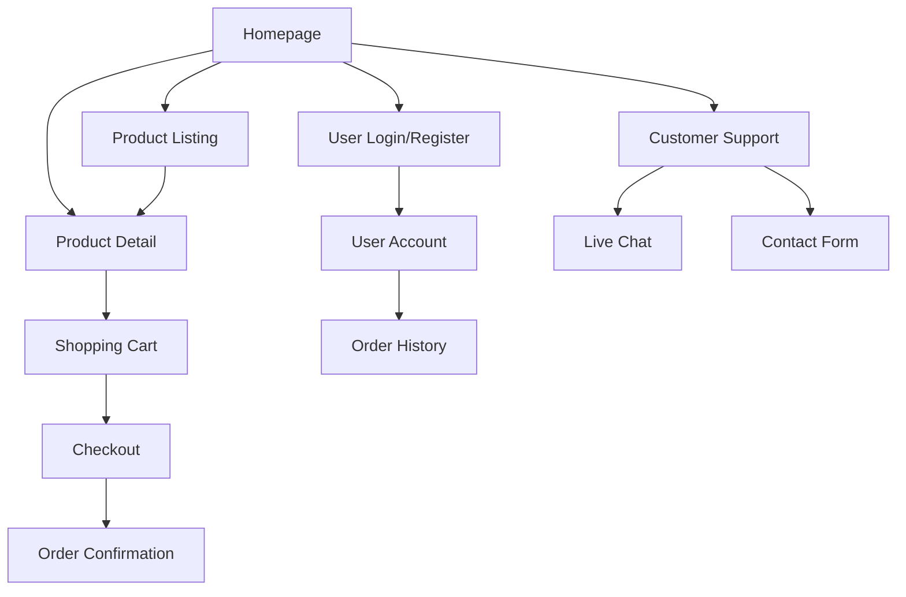

# Women's Fashion E-commerce Platform - Product Requirements Document

## 1. Product Overview
A modern women's fashion e-commerce platform targeting US and European markets, inspired by leading fast-fashion retailers like Zara and H&M. The platform provides a seamless shopping experience with clean design, mobile optimization, and comprehensive e-commerce functionality.

The platform addresses the need for accessible, trendy fashion shopping with intuitive user experience, multiple payment options, and reliable customer support to compete in the competitive fast-fashion market.

## 2. Core Features

### 2.1 User Roles
| Role | Registration Method | Core Permissions |
|------|---------------------|------------------|
| Guest User | No registration required | Browse products, view details, add to cart |
| Registered User | Email registration | Full shopping access, order history, saved preferences |
| Admin | Internal system access | Product management, order processing, customer support |

### 2.2 Feature Module
Our women's fashion e-commerce platform consists of the following main pages:
1. **Homepage**: hero banner, new arrivals showcase, bestsellers section, new user registration popup.
2. **Product Listing Page**: product grid display, search functionality, filtering system, sorting options.
3. **Product Detail Page**: product image gallery, size selection, product information, customer reviews, add to cart.
4. **Shopping Cart**: item management, quantity adjustment, price calculation, checkout initiation.
5. **Checkout Page**: shipping information form, payment method selection, order summary, order confirmation.
6. **User Account Pages**: login/registration forms, order history, profile management.
7. **Customer Support**: live chat interface, contact form, FAQ section.
8. **Coming Soon Pages**: placeholder pages for future features with "Coming Soon" messaging.

### 2.3 Page Details
| Page Name | Module Name | Feature description |
|-----------|-------------|---------------------|
| Homepage | Hero Banner | Display rotating promotional banners with call-to-action buttons |
| Homepage | New Arrivals | Showcase latest product additions with quick view options |
| Homepage | Bestsellers | Highlight top-selling items with popularity indicators |
| Homepage | New User Popup | Modal for email signup with welcome discount offer |
| Product Listing | Product Grid | Display products in responsive grid layout with hover effects |
| Product Listing | Search Bar | Real-time search with autocomplete and suggestion features |
| Product Listing | Filter System | Filter by category, size, color, price range, brand |
| Product Listing | Sort Options | Sort by price, popularity, newest, customer rating |
| Product Detail | Image Gallery | High-resolution product images with zoom and multiple angles |
| Product Detail | Size Guide | Interactive size chart with fit recommendations |
| Product Detail | Product Info | Detailed descriptions, materials, care instructions |
| Product Detail | Reviews Section | Customer reviews with ratings and photo uploads |
| Product Detail | Add to Cart | Size selection, quantity picker, wishlist option |
| Shopping Cart | Item Management | View, edit quantities, remove items, save for later |
| Shopping Cart | Price Calculator | Subtotal, shipping, taxes, discount codes, total calculation |
| Checkout | Shipping Form | Address input, delivery options, shipping cost calculation |
| Checkout | Payment Methods | Visa, PayPal, Apple Pay, Klarna integration |
| Checkout | Order Summary | Final review before purchase confirmation |
| User Account | Authentication | Email/password login, registration, password reset |
| User Account | Order History | Past orders with tracking, reorder functionality |
| User Account | Profile Management | Personal information, preferences, address book |
| Customer Support | Live Chat | Real-time chat with support agents |
| Customer Support | Contact Form | Email support with category selection |
| Coming Soon | Placeholder | "Coming Soon" message with newsletter signup |

## 3. Core Process
**Guest User Shopping Flow:**
Users can browse the homepage, navigate to product listings, use search and filters to find items, view product details, add items to cart, and proceed to checkout where they can either continue as guest or create an account.

**Registered User Flow:**
Registered users follow the same shopping flow but with additional benefits like saved preferences, order history access, faster checkout with saved payment methods, and personalized recommendations.

**Admin Management Flow:**
Admins access a separate dashboard to manage products, process orders, handle customer inquiries, and monitor site analytics.

## 4. User Interface Design
### 4.1 Design Style
- **Primary Colors**: Black (#000000), White (#FFFFFF), Light Gray (#F5F5F5)
- **Accent Colors**: Soft Beige (#F7F3E9), Navy Blue (#1B2951)
- **Button Style**: Clean rectangular buttons with subtle hover animations
- **Typography**: Modern sans-serif fonts, 16px base size, clear hierarchy
- **Layout Style**: Minimalist grid-based design with ample white space
- **Icons**: Unified line-style icons, consistent stroke width, no emojis

### 4.2 Page Design Overview
| Page Name | Module Name | UI Elements |
|-----------|-------------|-------------|
| Homepage | Hero Banner | Full-width image slider, overlay text, CTA buttons with hover effects |
| Homepage | Product Sections | Clean grid layout, product cards with subtle shadows, hover zoom |
| Product Listing | Filter Sidebar | Collapsible filters, checkbox/dropdown controls, clear all option |
| Product Listing | Product Grid | Responsive cards, quick view overlay, wishlist heart icon |
| Product Detail | Image Gallery | Large main image, thumbnail strip, zoom functionality |
| Product Detail | Product Info | Structured layout, size selector buttons, quantity stepper |
| Shopping Cart | Cart Items | List layout with product images, quantity controls, remove buttons |
| Checkout | Form Sections | Step-by-step progress indicator, grouped form fields, payment icons |
| User Account | Navigation | Tab-based navigation, clean form layouts, action buttons |

### 4.3 Responsiveness
Mobile-first responsive design with breakpoints at 768px (tablet) and 1024px (desktop). Touch-optimized interactions for mobile devices with larger tap targets and swipe gestures for image galleries.