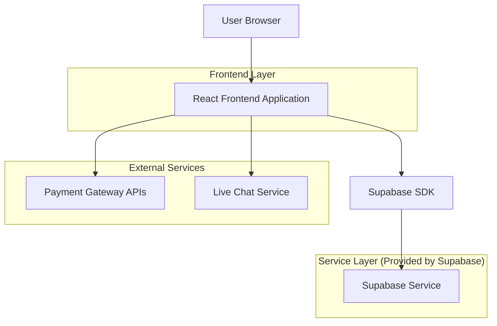
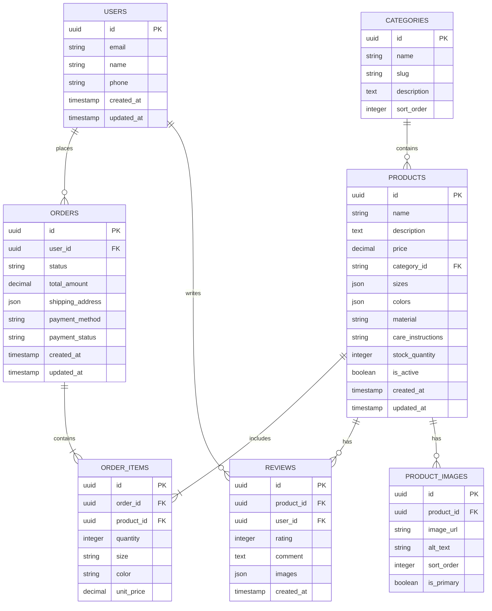

# Women's Fashion E-commerce Platform - Technical Architecture Document

## 1. Architecture Design



## 2. Technology Description

* Frontend: React\@18 + TypeScript + Tailwind CSS\@3 + Vite

* Backend: Supabase (Authentication, Database, Storage)

* Payment Processing: Stripe (Visa, PayPal, Apple Pay), Klarna API

* Live Chat: Intercom or Zendesk Chat

* Image Storage: Supabase Storage

* Deployment: Vercel or Netlify

## 3. Route Definitions

| Route           | Purpose                                              |
| --------------- | ---------------------------------------------------- |
| /               | Homepage with hero banner, new arrivals, bestsellers |
| /products       | Product listing page with search and filters         |
| /products/:id   | Product detail page with images, sizes, reviews      |
| /cart           | Shopping cart with item management                   |
| /checkout       | Checkout process with shipping and payment           |
| /login          | User authentication page                             |
| /register       | User registration page                               |
| /account        | User account dashboard                               |
| /account/orders | Order history and tracking                           |
| /support        | Customer support with live chat                      |
| /coming-soon    | Placeholder for unimplemented features               |

## 4. API Definitions

### 4.1 Core API

**Product Management**

```
GET /api/products
```

Request:

| Param Name | Param Type | isRequired | Description                |
| ---------- | ---------- | ---------- | -------------------------- |
| category   | string     | false      | Filter by product category |
| search     | string     | false      | Search query for products  |
| minPrice   | number     | false      | Minimum price filter       |
| maxPrice   | number     | false      | Maximum price filter       |
| size       | string     | false      | Filter by available sizes  |
| page       | number     | false      | Pagination page number     |
| limit      | number     | false      | Items per page             |

Response:

| Param Name | Param Type | Description              |
| ---------- | ---------- | ------------------------ |
| products   | Product\[] | Array of product objects |
| totalCount | number     | Total number of products |
| hasMore    | boolean    | Whether more pages exist |

**Order Management**

```
POST /api/orders
```

Request:

| Param Name      | Param Type  | isRequired | Description             |
| --------------- | ----------- | ---------- | ----------------------- |
| items           | CartItem\[] | true       | Array of cart items     |
| shippingAddress | Address     | true       | Shipping address object |
| paymentMethod   | string      | true       | Selected payment method |
| paymentToken    | string      | true       | Payment gateway token   |

Response:

| Param Name  | Param Type | Description             |
| ----------- | ---------- | ----------------------- |
| orderId     | string     | Unique order identifier |
| status      | string     | Order processing status |
| totalAmount | number     | Final order total       |

**User Authentication**

```
POST /api/auth/login
```

Request:

| Param Name | Param Type | isRequired | Description        |
| ---------- | ---------- | ---------- | ------------------ |
| email      | string     | true       | User email address |
| password   | string     | true       | User password      |

Response:

| Param Name | Param Type | Description            |
| ---------- | ---------- | ---------------------- |
| user       | User       | User profile object    |
| session    | Session    | Authentication session |

## 5. Data Model

### 5.1 Data Model Definition



### 5.2 Data Definition Language

**Users Table**

```sql
CREATE TABLE users (
    id UUID PRIMARY KEY DEFAULT gen_random_uuid(),
    email VARCHAR(255) UNIQUE NOT NULL,
    name VARCHAR(100) NOT NULL,
    phone VARCHAR(20),
    created_at TIMESTAMP WITH TIME ZONE DEFAULT NOW(),
    updated_at TIMESTAMP WITH TIME ZONE DEFAULT NOW()
);

-- Enable RLS
ALTER TABLE users ENABLE ROW LEVEL SECURITY;

-- Policies
CREATE POLICY "Users can view own profile" ON users
    FOR SELECT USING (auth.uid() = id);

CREATE POLICY "Users can update own profile" ON users
    FOR UPDATE USING (auth.uid() = id);

-- Grants
GRANT SELECT ON users TO authenticated;
GRANT UPDATE ON users TO authenticated;
```

**Products Table**

```sql
CREATE TABLE products (
    id UUID PRIMARY KEY DEFAULT gen_random_uuid(),
    name VARCHAR(255) NOT NULL,
    description TEXT,
    price DECIMAL(10,2) NOT NULL,
    category_id UUID REFERENCES categories(id),
    sizes JSONB DEFAULT '[]',
    colors JSONB DEFAULT '[]',
    material VARCHAR(255),
    care_instructions TEXT,
    stock_quantity INTEGER DEFAULT 0,
    is_active BOOLEAN DEFAULT true,
    created_at TIMESTAMP WITH TIME ZONE DEFAULT NOW(),
    updated_at TIMESTAMP WITH TIME ZONE DEFAULT NOW()
);

-- Indexes
CREATE INDEX idx_products_category ON products(category_id);
CREATE INDEX idx_products_price ON products(price);
CREATE INDEX idx_products_active ON products(is_active);

-- Enable RLS
ALTER TABLE products ENABLE ROW LEVEL SECURITY;

-- Policies
CREATE POLICY "Products are viewable by everyone" ON products
    FOR SELECT USING (is_active = true);

-- Grants
GRANT SELECT ON products TO anon;
GRANT ALL PRIVILEGES ON products TO authenticated;
```

**Orders Table**

```sql
CREATE TABLE orders (
    id UUID PRIMARY KEY DEFAULT gen_random_uuid(),
    user_id UUID REFERENCES users(id),
    status VARCHAR(50) DEFAULT 'pending',
    total_amount DECIMAL(10,2) NOT NULL,
    shipping_address JSONB NOT NULL,
    payment_method VARCHAR(50) NOT NULL,
    payment_status VARCHAR(50) DEFAULT 'pending',
    created_at TIMESTAMP WITH TIME ZONE DEFAULT NOW(),
    updated_at TIMESTAMP WITH TIME ZONE DEFAULT NOW()
);

-- Indexes
CREATE INDEX idx_orders_user_id ON orders(user_id);
CREATE INDEX idx_orders_status ON orders(status);
CREATE INDEX idx_orders_created_at ON orders(created_at DESC);

-- Enable RLS
ALTER TABLE orders ENABLE ROW LEVEL SECURITY;

-- Policies
CREATE POLICY "Users can view own orders" ON orders
    FOR SELECT USING (auth.uid() = user_id);

CREATE POLICY "Users can create own orders" ON orders
    FOR INSERT WITH CHECK (auth.uid() = user_id);

-- Grants
GRANT ALL PRIVILEGES ON orders TO authenticated;
```

**Initial Data**

```sql
-- Categories
INSERT INTO categories (name, slug, description, sort_order) VALUES
('Dresses', 'dresses', 'Elegant dresses for every occasion', 1),
('Tops', 'tops', 'Stylish tops and blouses', 2),
('Bottoms', 'bottoms', 'Pants, jeans, and skirts', 3),
('Outerwear', 'outerwear', 'Jackets and coats', 4),
('Accessories', 'accessories', 'Bags, jewelry, and more', 5);

-- Sample Products
INSERT INTO products (name, description, price, category_id, sizes, colors, material, stock_quantity) VALUES
('Floral Midi Dress', 'Beautiful floral print midi dress perfect for spring', 79.99, 
 (SELECT id FROM categories WHERE slug = 'dresses'), 
 '["XS", "S", "M", "L", "XL"]', 
 '["Floral Print", "Navy Floral"]', 
 '100% Viscose', 50),
('Classic White Shirt', 'Timeless white button-down shirt', 49.99, 
 (SELECT id FROM categories WHERE slug = 'tops'), 
 '["XS", "S", "M", "L", "XL"]', 
 '["White", "Light Blue"]', 
 '100% Cotton', 75);
```

